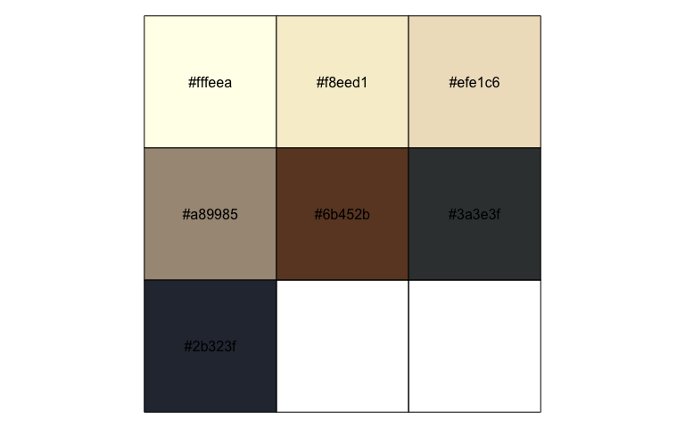
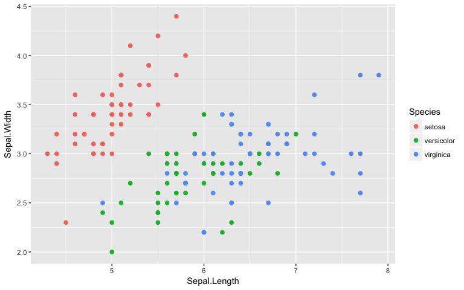
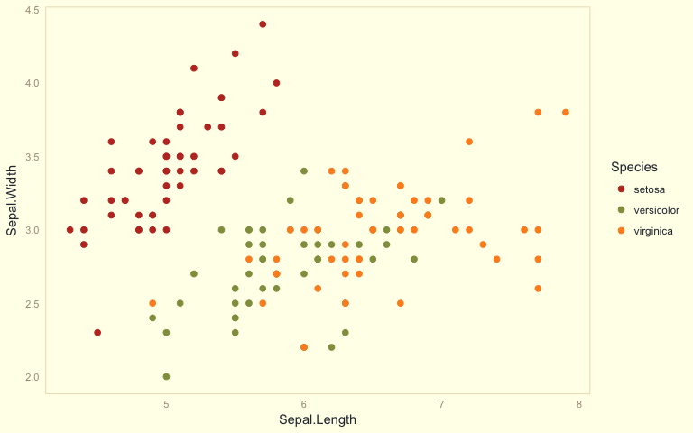
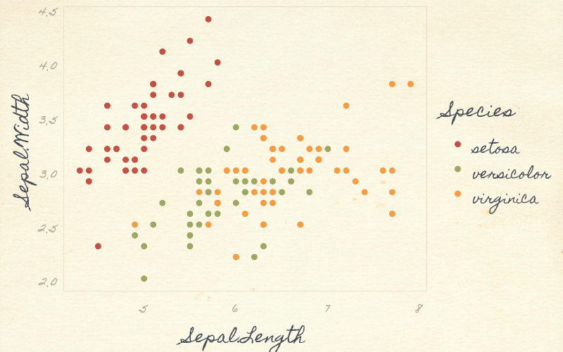
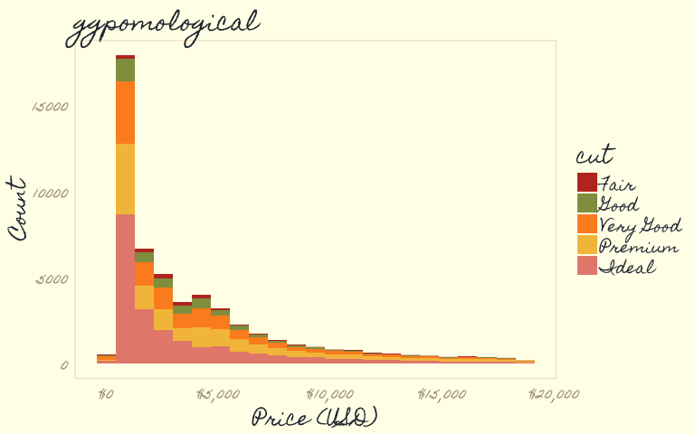
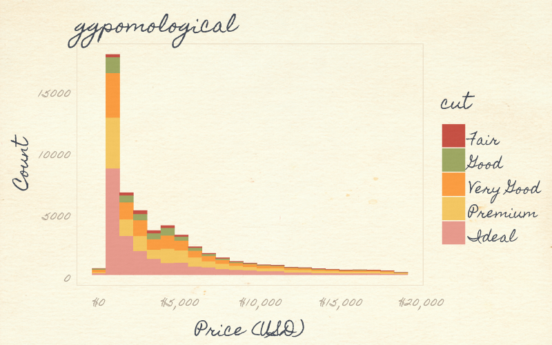
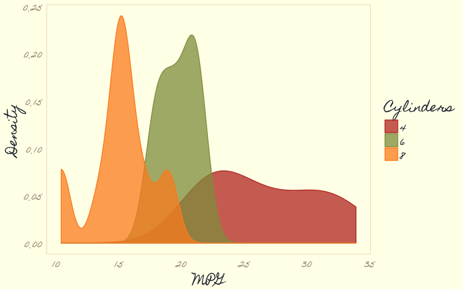
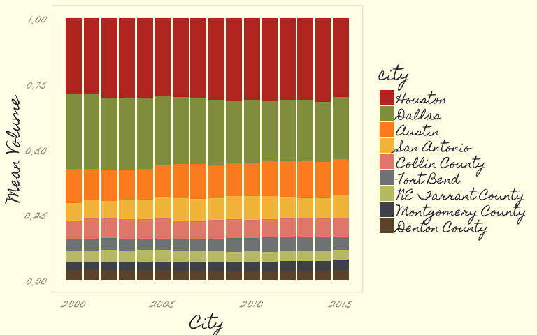
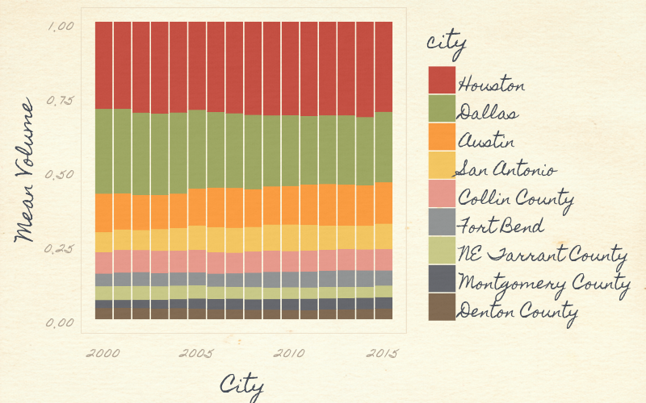
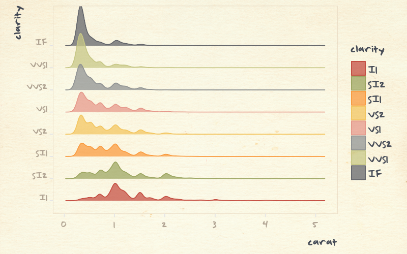

Pomological Colors
================
Garrick Aden-Buie
2/4/2018

## Pomological Plots


Inspired by talk at **LINK rstudio conf** by **LINK talk about
parameterized rmarkdown**.

Went through **LINK USDA pomological** oh and also **LINK
@pomological**.

<https://usdawatercolors.nal.usda.gov/pom>

## Color Palette

Picked out a LOT of colors.


Chose a few:

``` r
pomological_palette <- c(
  "#c03728", #red
  "#919c4c", #green darkish
  "#fd8f24", #orange brighter
  # "#f2692e", #orange
  "#f5c04a", #yelloww
  "#e68c7c", #pink
  "#828585", #light grey
  "#c3c377", #green light
  "#4f5157", #darker blue/grey
  # "#912b1b", #red, darker
  "#6f5438", #lighter brown
  # "#ec4339", #red/pink
  # "#6b452b", #brown
  NULL
)

pomological_base <- list(
  "paper" = "#fffeea",
  'paper_alt' = "#f8eed1",
  'light_line' = '#efe1c6',
  'medium_line' = "#a89985",
  'darker_line' = "#6b452b",
  'black' = "#3a3e3f",
  "dark_blue" = "#2b323f"
)

# Palette colors
scales::show_col(pomological_palette)
```

<!-- -->

``` r
# Base colors
scales::show_col(unlist(pomological_base))
```

<!-- -->

## Setup theme and scales

Theme is basic in two flavors, one with paper-colored background and the
other transparent bg.

Uses fonts from Google\! I tried a few, liked

  - [Homemade Apple](https://fonts.google.com/specimen/Homemade+Apple/)
  - [Amatic SC](https://fonts.google.com/specimen/Amatic+SC/)
  - [Mr. Bedfort](https://fonts.google.com/specimen/Mr+Bedfort/)

I also have a handwriting font from my own handwriting that looks great

``` r
pomological_theme <- function(
  base_family = 'Homemade Apple', 
  base_size = 16,
  text.color = NULL,
  plot.background.color = NULL,
  panel.grid.color = NULL,
  panel.grid.linetype = 'dashed',
  axis.text.color = NULL,
  axis.text.size = base_size * 14/16,
  base_theme = ggplot2::theme_minimal()
) {
  pomological_base <- list(
    "paper" = "#fffeea",
    'paper_alt' = "#f8eed1",
    'light_line' = '#efe1c6',
    'medium_line' = "#a89985",
    'darker_line' = "#6b452b",
    'black' = "#3a3e3f",
    "dark_blue" = "#2b323f"
  )
  
  base_theme + 
    ggplot2::theme(
      text = element_text(
        family = base_family, 
        size = base_size, 
        color = ifelse(hasArg(text.color), text.color, pomological_base$dark_blue)
      ),
      plot.background = element_rect(
        fill = ifelse(hasArg(plot.background.color), plot.background.color, pomological_base$paper), 
        color = NA
      ),
      panel.grid = element_line(
        color = ifelse(hasArg(panel.grid.color), panel.grid.color, pomological_base$light_line),
        linetype = panel.grid.linetype),
      axis.text = element_text(
        color = ifelse(hasArg(axis.text.color), axis.text.color, pomological_base$medium_line), 
        size = axis.text.size)
    )
}

pomological_theme_nobg <- function(...) {
  dots <- list(...)
  dots$plot.background.color <- 'transparent'
  do.call('pomological_theme', args = dots)
}
```

scales…

``` r
# learned this from https://github.com/hrbrmstr/hrbrthemes/blob/13f9b59579f007b8a5cbe5c699cbe3ec5fdd28a1/R/color.r
pomological_pal <- function() scales::manual_pal(pomological_palette)

# Scale color
scale_colour_pomological <- function(...) ggplot2::discrete_scale("colour", "pomological", pomological_pal(), ...)
scale_color_pomological <- scale_colour_pomological

# Scale fill
scale_fill_pomological <- function(...) ggplot2::discrete_scale('fill', 'pomological', pomological_pal(), ...)
```

In the future, I might come back to this to:

1.  Increase colors in discrete scale

2.  Setup a color-pairs plot. Lots of great color pairs in the extracted
    colors.

3.  Set up continuous scale colors (meh.)

## Add paper background\!

This is great. Uses **LINK magick** to add paper background.

``` r
paint_pomological <- function(
  pomo_gg, 
  width = 800, 
  height = 500, 
  pointsize = 16, 
  pomological_background = 'pomological_bg.png', 
  pomological_overlay = "pomological_overlay.jpg",
  outfile = NULL,
  ...
) {
  requireNamespace('magick', quietly = TRUE)
  requireNamespace('glue', quietly = TRUE)
  if (!file.exists(pomological_background)) {
    warning(glue::glue("Cannot find file \"{pomological_background}\", so you can have your plot back!"))
    return(pomo_gg)
  }
  
  # Paint figure
  gg_fig <- magick::image_graph(width, height, bg = 'transparent', pointsize = pointsize, ...)
  print(pomo_gg)
  dev.off()
  
  if (!is.null(pomological_overlay) && file.exists(pomological_overlay)) {
    pomo_over <- magick::image_read(pomological_overlay)
    pomo_over <- magick::image_resize(pomo_over, glue::glue("{width}x{height}!"))
    gg_fig <- magick::image_composite(gg_fig, pomo_over, "blend", compose_args = "15")
  }
  
  # Paint background
  pomo_bg <- magick::image_read(pomological_background)
  pomo_bg <- magick::image_resize(pomo_bg, glue::glue("{width}x{height}!"))
  pomo_bg <- magick::image_crop(pomo_bg, glue::glue("{width}x{height}"))
  
  # Paint figure onto background
  pomo_img <- magick::image_composite(pomo_bg, gg_fig)
  if (!is.null(outfile)) {
    # Do you want your picture framed?
    magick::image_write(pomo_img, outfile)
  }
  pomo_img
}
```

## Demo\!

We’ll need dplyr and ggplot2

``` r
library(dplyr)
```

    ## 
    ## Attaching package: 'dplyr'

    ## The following objects are masked from 'package:stats':
    ## 
    ##     filter, lag

    ## The following objects are masked from 'package:base':
    ## 
    ##     intersect, setdiff, setequal, union

``` r
library(ggplot2)
```

### Basic iris plot

``` r
# Base plot
basic_iris_plot <- ggplot(iris) +
  aes(x = Sepal.Length, y = Sepal.Width, color = Species) +
  geom_point(size = 2)

# Just your standard Iris plot
basic_iris_plot 
```

<!-- -->

``` r
# With pomological theme
basic_iris_plot +
  pomological_theme() +
  scale_color_pomological()
```

<!-- -->

``` r
# With transparent background
pomological_iris <- basic_iris_plot +
  pomological_theme_nobg() +
  scale_color_pomological()
pomological_iris 
```

<!-- -->

``` r
# Painted!
paint_pomological(pomological_iris, res = 110) %>% 
  magick::image_write("Readme_files/figure-gfm/plot-demo-painted.png")
```



### Stacked bar chart

``` r
stacked_bar_plot <- ggplot(diamonds) +
  aes(price, fill = cut) +
  geom_histogram(binwidth = 850) + 
  xlab('Price (USD)') + 
  ylab('Count') + 
  scale_x_continuous(label = scales::dollar_format()) +
  scale_fill_pomological()

stacked_bar_plot + pomological_theme()
```

<!-- -->

``` r
paint_pomological(
  stacked_bar_plot + pomological_theme_nobg(),
  res = 110
) %>% 
  magick::image_write("Readme_files/figure-gfm/plot-bar-chart-painted.png")
```



### Density Plot

``` r
density_plot <- mtcars %>% 
  mutate(cyl = factor(cyl)) %>% 
  ggplot() +
  aes(mpg, fill = cyl, color = cyl)+
  geom_density(alpha = 0.75) + 
  labs(fill = 'Cylinders', colour = 'Cylinders', x = 'MPG', y = 'Density') +
  scale_color_pomological() +
  scale_fill_pomological()

density_plot + pomological_theme()
```

<!-- -->

``` r
paint_pomological(
  density_plot + pomological_theme_nobg(),
  res = 110
) %>% 
  magick::image_write("Readme_files/figure-gfm/plot-density-demo-painted.png")
```


### Points and lines

Data from the Texas Housing

``` r
big_volume_cities <- txhousing %>% 
  group_by(city) %>% 
  summarize(mean_volume = mean(volume, na.rm = TRUE)) %>% 
  arrange(-mean_volume) %>% 
  top_n(length(pomological_palette)) %>% 
  pull(city)
```

    ## Selecting by mean_volume

``` r
full_bar_stack_plot <- txhousing %>% 
  filter(city %in% big_volume_cities) %>% 
  group_by(city, year) %>% 
  summarize(mean_volume = mean(volume, na.rm = TRUE)) %>% 
  ungroup %>% 
  mutate(city = factor(city, big_volume_cities)) %>% 
  ggplot() +
  aes(year, mean_volume, fill = city, group = city) +
  geom_col(position = 'fill', width = 0.9) +
  labs(x = 'City', y = 'Mean Volume', color = 'City') +
  theme(panel.grid.minor.x = element_blank()) +
  scale_fill_pomological()

full_bar_stack_plot + pomological_theme()
```

<!-- -->

``` r
paint_pomological(
  full_bar_stack_plot + pomological_theme_nobg(),
  res = 110
) %>% 
  magick::image_write("Readme_files/figure-gfm/plot-full-bar-stack-painted.png")
```



### One last plot

(in my handwriting)

``` r
ridges_pomological <- ggplot(diamonds) + 
  aes(x = carat, y = clarity, color = clarity, fill = clarity) + 
  ggridges::geom_density_ridges(alpha = 0.75) + 
  pomological_theme_nobg(
    base_family = 'gWriting',
    base_size = 20,
    base_theme = ggridges::theme_ridges()
    ) + 
  scale_fill_pomological() + 
  scale_color_pomological()

paint_pomological(ridges_pomological, res = 110) %>% 
  magick::image_write("Readme_files/figure-gfm/plot-ridges-painted.png")
```

    ## Picking joint bandwidth of 0.057



## Appendix

<details>

<summary>Some functions I wrote while exploring colors, that may or may
not work here.</summary>

``` r
# load all colors
x <- readLines("pomological.css")
x <- stringr::str_extract(x, "#[0-9a-f]{6}")
x <- x[!is.na(x)]

gg_color_hue <- function(n) {
  hues = seq(15, 375, length = n + 1)
  hcl(h = hues, l = 65, c = 100)[1:n]
}

col2hsv <- function(x) rgb2hsv(col2rgb(x))


dist2ref_color <- function(color, ref_color) {
  stopifnot(length(ref_color) == 1)
  x <- col2hsv(c(color, ref_color)) %>% 
    t %>%
    dist %>%
    as.matrix %>%
    {tibble('ref_color' = .[length(color) + 1, 1:length(color)])}
  names(x) <- ref_color
  x
}

compare_to_ggplot <- function(compare_to_ggplot) {
  pomo_gg <- map_dfr(set_names(compare_to_ggplot), ~ as_tibble(t(col2hsv(.))), .id = "color") %>% 
    bind_cols(
      map_dfc(gg_color_hue(set_names(length(compare_to_ggplot))), ~ dist2ref_color(compare_to_ggplot, .))
    ) %>% 
    tidyr::gather('ggplot_color', 'dist', -color:-v) %>% 
    # group_by(color) %>% 
    # do(dist = min(.$dist), ggplot_color = filter(., dist == min(.$dist))$ggplot_color) %>% 
    # mutate(dist = map_dbl(dist, ~ .), ggplot_color = map_chr(ggplot_color, ~ .)) %>% 
    # ungroup %>% 
    mutate(ggplot_color = factor(ggplot_color, gg_color_hue(length(compare_to_ggplot)))) %>% 
    arrange(ggplot_color)
  warning(glue::glue("Palette has {length(compare_to_ggplot)} colors"), call. = FALSE)
  ggplot(pomo_gg) +
    aes(x = ggplot_color, y = dist, fill = color, label = color) +
    geom_label(color = 'white')+
    # geom_point(shape = 15, size = 5) +
    scale_fill_identity()
}

data_frame(
  'color' = color_options,
  # 'group' = sample(c('pomo', 'logical'), length(color_options), replace = TRUE),
  'x' = pmap_chr(tidyr::crossing(letters, letters), ~paste0(..1, ..2))[1:length(color_options)],
  'y' = 1:length(color_options)
) %>% 
  ggplot() +
  aes(x, y, fill = color) +
  # geom_point(size = 8)+
  geom_col()+
  geom_text(aes(label = color), hjust = -0.1) +
  scale_fill_identity() +
  coord_flip() +
  theme_minimal() +
  #theme_xkcd() +
  theme(
    text = element_text(family = 'gWriting', size = 16),
    plot.background = element_rect(fill = base_colors["paper_light"], color = NA),
    panel.grid = element_line(color = "#efe1c6"),
    axis.text = element_text(color = "#655843", size = 14)
  )

ordered_plot <- function(color_options, dichromat = FALSE) {
  if (dichromat) {
    dichr_type <- sample(c("deutan", "protan", "tritan"), 1)
    message(glue::glue("color blindness: {dichr_type}"))
    color_options <- dichromat::dichromat(color_options, dichr_type)
  }
  data_frame(
    color = color_options,
    x = 1,
    y = 1:length(color_options)
  ) %>% 
    ggplot() +
    aes(x, y, fill = color, label = color) +
    geom_tile() +
    geom_label(color = 'white') +
    scale_fill_identity()+
    scale_y_continuous(breaks = 1:length(color_options), labels = 1:length(color_options))+
    theme_minimal()
}
```

</details>
